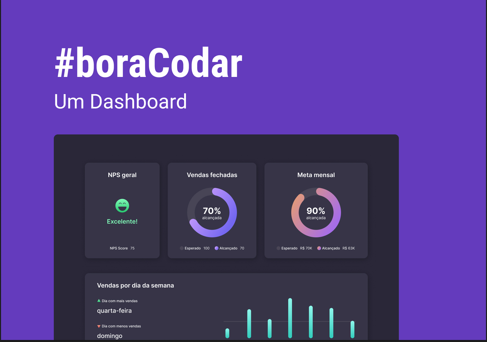

<h1 align="center">#boraCodar Um Dashbord</h1>

    
    
    

 

    

 

    

 

## Sobre Este Bora Codar

Bora cuidar é um projeto da [Rocketseat](https://www.rocketseat.com.br/boracodar), onde semanalmente é lançado desafios para comunidade, a fim de praticar nossa hard skill, onde é fornecido apenas o layout do projeto, de forma que ficamos libre que fazê-lo como quisermos, podendo usar qualquer tecnologias, adicionar funcionalidade novas, melhorar o layout etc.

 

## Sobre Este Projeto

Este bora codar é um dashboard de gestão de vendas onde temos percentual de vendas fechadas alcançada e esperado, metal mensal também em percentual com esperado e alcançada é por fim um card que mostra vendas por dia da semana, onde mostra na primeira seção em texto o dia que mais vendeu no mês referido é também o dia que menos vendeu. em uma segunda seção este mesmo card mostra as vendas por dia da semana em gráfico de barra este mesmo mês.

## Observações
Não foi possível fazer os gráficos circulares com "gradient" usando [react-circular-progressbar](https://www.npmjs.com/package/react-circular-progressbar) por uma limitação minha mesmo, futuramente será implementado.

 

    
    <a href="https://www.figma.com/community/file/1210217615683203825">Link do projeto no figma</a>

   

## Tecnologias Usadas

* HTML
* CSS
* JavaScript
* ReactJS
* TailwindCSS
* ViteJS
* Vercel

 

👤 **Micaela Pinheiro**

- Twitter: [@micaelapinheir7](https://twitter.com/micaelapinheir7)
- Github: [@MicaelaPinheiroDS](https://github.com/MicaelaPinheiroDS)
- LinkedIn: [@micaela-pinheiro](https://linkedin.com/in/micaela-pinheiro)

 

## 📝 License
---
This project is MIT licensed.

